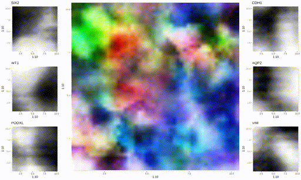

# Generalised Canonical Procrustes
A generative encoding method - ideas stemming from the geometric Procrustes, the statistical Canonical Correlation Analysis, and the neural network Autoencoder.

A method that uses a likelihood model to align two datasets via an encoding in a lower dimensional space

Current Paper (Biorxiv pending)
https://www.askexplain.com/generative-encoding

Example of single cell RNA-seq (matrix, rows are genes, columns are cells) aligned to Spatial Transcriptomic information (histology image, and, spot-gene expression matrix). Gene expression is visualised and corresponds to the immunofluoresecent tissue. Notice tissue structure changes through space and time (and is a function of gene expression at each time and spatial point).

More information can be found at: https://github.com/AskExplain/gcproc_analysis
