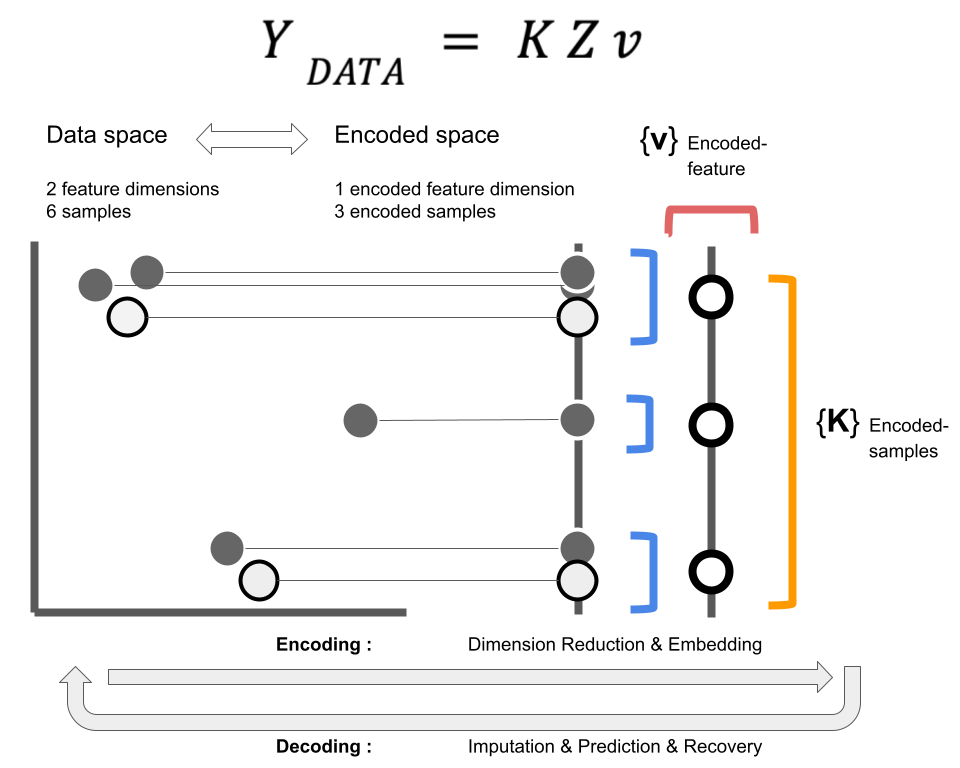

```{r setup, include=FALSE}
knitr::opts_chunk$set(echo = FALSE)
```

### Introduction

Generalised Canonical Procrustes (gcproc) can recover missing values in a dataset via a prediction or imputation step, depending on the missingness of the data. Recovery begins by projecting the features of the data into a reduced dimensional subspace: encoding to improve information quality. When both the predictor (y) and feature (x) variables are transformed via the encoding projection learned in gcproc, a machine learning model is used to find an estimate of the predictor. The key step in this process is learning a set of parameters via gcproc that encode the features to enrich the information quality before input into the model for regression.

```{r gcproc_explained, out.width = "150%", out.height = "150%"}

```

### Step 0 - Prepare libraries

```{r step_0}
library(gcproc,quietly = T)
library(mclust,quietly = T)
library(irlba,quietly = T)

```


### Step 1 - Initialise config
```{r step_1}

config.recover <- gcproc::extract_config(T)
config.recover$i_dim <- 500
config.recover$j_dim <- 30
config.recover$method <- "gcproc"
config.recover$init <- c("random","svd")
config.recover$max_iter <- 50
config.recover$min_iter <- 5
config.recover$verbose <- T
config.recover$n_cores <- 1
config.recover$n_batch <- 1
config.recover$n_epoch <- 2
config.recover$identify<-F

```


### Step 2 - Prepare data

```{r step_2}

predict.list <- list()
predict.names <- c("QuickStartExample","golub","Vehicle","wine")

library(glmnet)
data("QuickStartExample")
predict.list[[1]] <- cbind(QuickStartExample$y,QuickStartExample$x)

library(multtest)
data("golub")
predict.list[[2]] <- golub[,order(apply(golub,2,var),decreasing = T)[1:10]]

library(mlbench)
data("Vehicle")
predict.list[[3]] <- as.matrix(Vehicle[,-c(19)])

library(pdfCluster)
data("wine")
predict.list[[4]] <- as.matrix(wine[,-c(1)])


```


### Step 3 - Run gcproc, glmnet and linear model on test datasets

Three models are run: gcproc, glmnet and lm - respectively they are Generalised Canonical Procrustes, a Regularised Generalised Linear Model, and a Standard Linear Model. The root mean squared error is reported, along with the pearson correlation.
  
Four datasets are used in this regression to recover missing values. The most variable feature is listed as the variable to be predicted, while all other variables are listed as the covariates.

```{r step_3,warning=FALSE}

for (list_id in c(1:length(predict.list))){
  # Take dataset
  data___x <- data.frame(predict.list[[list_id]])
  
  # Find most variable feature
  y_predict.id_col <- tail(order(apply(data___x,2,var)),1)
  
  main_scores.1 <- c()
  
  for (seed in c(1:3)){
    
    # Set up training ids
    set.seed(seed)
    train_id <- sample(c(1:dim(data___x)[1]),size = dim(data___x)[1]*0.9)
    
    # Set up y column by looping through each column
    
    # glmnet
    glmnet_start_time <- Sys.time()
    glmnet_predict <- predict(glmnet::cv.glmnet(x=as.matrix(data___x[train_id,-c(y_predict.id_col)]),y=as.matrix(data___x[train_id,y_predict.id_col]),type.measure = "mse"),as.matrix(data___x[-train_id,-c(y_predict.id_col)]), s = "lambda.min")
    glmnet_end_time <- Sys.time()

    # lm
    lm_start_time <- Sys.time()
    lm_predict <- predict(lm(as.matrix(data___x[train_id,y_predict.id_col])~.,data=data.frame(x=data___x[train_id,-c(y_predict.id_col)])),data.frame(x=data___x[-train_id,-c(y_predict.id_col)]))
    lm_end_time <- Sys.time()

    
    # Set up gcproc
    
    # Set up recovery for gcproc
    recover <- gcproc::extract_recovery_framework(F)
    recover$task <- c("regression")
    recover$method <- c("decode")
    recover.x <- array(0,dim=dim(data___x))
    recover.x[-train_id,y_predict.id_col] <- 1
    
    # Initialise missing values given by recovery design matrix with median feature value
    x.x.check <- as.matrix(data___x)
    x.x.check[-train_id,y_predict.id_col] <- lm_predict

    main_data <- list(x.x.check)
    
    recover$design.list <- list(recover.x)
    
    # Run gcproc
    gcproc_start_time <- Sys.time()
    gcproc.model <- gcproc::multiple_imputation(data_list = main_data,
                                                multi_impute = 1,
                                               config = config.recover,
                                               recover = recover,
                                               join = list(alpha=c(1),beta=c(1))
                                               )
    gcproc_end_time <- Sys.time()

    # Extract predicted values
    gcproc.recover <- Reduce("+",lapply(c(1),function(X){gcproc.model[[X]][[1]]}))/1
    
    y_hat.plot <- (gcproc.recover)[-train_id,y_predict.id_col]
    data___x.plot <- data___x[-train_id,y_predict.id_col]
    
    # Set up table for plotting
    vals <- data.frame(rbind(data.frame(seed,"Feature Column"=colnames(data___x)[y_predict.id_col],Metric="Loss: Root Mean Squared Error",
                                        data.frame(Method = c("gcproc","glmnet","linear model"),Value=c(mean(sqrt((y_hat.plot-data___x.plot)^2)),mean(sqrt((glmnet_predict-data___x.plot)^2)),mean(sqrt((lm_predict-data___x.plot)^2))))),
                             data.frame(seed,"Feature Column"=colnames(data___x)[y_predict.id_col],Metric="Correlation: Pearson",                                data.frame(Method=c("gcproc","glmnet","linear model"),Value=c(cor(y_hat.plot,data___x.plot),cor(glmnet_predict,data___x.plot),cor(lm_predict,data___x.plot)))
                             ),
                             data.frame(seed,"Feature Column"=colnames(data___x)[y_predict.id_col],Metric="Run Time",                                data.frame(Method=c("gcproc","glmnet","linear model"),Value=c(gcproc_end_time-gcproc_start_time,
                                                                                                                                                                               glmnet_end_time-glmnet_start_time,
                                                                                                                                                                               lm_end_time-lm_start_time))
                             )


    ))
    
    main_scores.1 <- rbind(main_scores.1,vals)
    
    
  }
  
  
  library(ggplot2)
  a <- ggplot((main_scores.1[main_scores.1$Metric=="Loss: Root Mean Squared Error",]), aes(x=Metric, y=Value, fill=Method))+ 
    geom_violin() + ggtitle(label = predict.names[list_id])
    print(a)
    
}


```


### Step 4 - Run gcproc and mice on various datasets with missigness via ampute

To induce missingness into the dataset, the default "missing at random" was induced via the ampute function via mice. This is in contrast to other types of missingness that can be [not at random], or [completely at random]. For gcproc, the missing data is initialized via the median value for the corresponding feature. The root mean squared error is reported, along with the pearson correlation.

```{r step_4,warning=FALSE}


for (list_id in c(1:length(predict.list))){
  # Take dataset
  data___x <- (predict.list[[list_id]])

  main_scores.2<-c()
  
  for (seed in 1:3){
    
    set.seed(seed)
    
    # Run mice
    data___x.check.main <- (as.matrix(as.data.frame(data___x)))
    data___x.check <- mice::ampute(data = data___x.check.main,mech = "MAR")
    mice_start_time <- Sys.time()
    data___x.check <- mice::mice(data___x.check$amp,printFlag = F)
    mice_end_time <- Sys.time()
    mice.pred <- mice::complete(data___x.check,5)
    
    mice.recover <- lapply(c(1:5),function(X){
      mice.pred <- mice::complete(data___x.check,X)
    })
    
    prediction <- Reduce("+",mice.recover) / 5
    
    standard.error <- sqrt(Reduce("+",lapply(c(1:length(mice.recover)),function(X){
      ((data___x.check.main - (mice.recover[[X]]))^2)
    }))/5)
    
    standard.error[standard.error==0] <- NA
    mice.se <- sd(unlist(standard.error),na.rm = T)
    
    # Set up recovery design matrix
    recover <- gcproc::extract_recovery_framework(F)
    recover.x <- (data___x.check$where)

    # Initialise missing values given by recovery design matrix with median feature value
    x.x.check <- as.matrix(data___x)
    x.x.check <- x.x.check*(1-recover.x) + do.call('cbind',lapply(c(1:dim(x.x.check*(1-recover.x))[2]),function(X){(recover.x[,X])*(median((x.x.check[which((1-recover.x)[,X]==1),X])))}))
    
    
    main_data <- list(x.x.check)
    
    recover$design.list <- list(recover.x)
    
    recover$task <- c("regression")
    recover$method <- c("matrix.projection")

    join <- gcproc::extract_join_framework(F)
    join$alpha <- c((1:length(main_data)))
    join$beta <- c((1:length(main_data)))
    
    gcproc_start_time <- Sys.time()
    gcproc.model <- gcproc::multiple_imputation(main_data,
                                                multi_impute = 5,
                                   config = config.recover,
                                   recover = recover,
                                   join = join
    )
    gcproc_end_time <- Sys.time()

    gcproc.recover <- Reduce("+",lapply(c(1:5),function(X){gcproc.model[[X]][[1]]}))/5

    standard.error <- sqrt(Reduce("+",lapply(c(1:length(gcproc.model)),function(X){
      ((data___x.check.main - (gcproc.model[[X]][[1]]))^2)
    }))/5)
    
    standard.error[standard.error==0] <- NA
    gcproc.se <- sd(unlist(standard.error),na.rm = T)
    
    # Extract imputed values
    y_hat.plot <- gcproc.recover[which((recover.x)==1,arr.ind = T)]
    data___x.plot <- data___x[which((recover.x)==1,arr.ind = T)]
    mice.pred.plot <- mice.pred[which((recover.x)==1,arr.ind = T)]
    
    # Set up table for plotting
    vals <- data.frame(rbind(data.frame(seed,Metric="Loss: Root Mean Squared Error",
                                        data.frame(Method = c("gcproc","mice"),Value=c(
                                          mean(sqrt((y_hat.plot-data___x.plot)^2)),mean(sqrt((mice.pred.plot-data___x.plot)^2))
                                        ))),
                             data.frame(seed,Metric="Correlation: Pearson",                                data.frame(Method=c("gcproc","mice"),Value=c(
                               cor(y_hat.plot,data___x.plot),cor(mice.pred.plot,data___x.plot)))
                             ),
                             data.frame(seed,Metric="Run Time",                                data.frame(Method=c("gcproc","mice"),Value=c(
                               cor(y_hat.plot,data___x.plot),cor(mice.pred.plot,data___x.plot)))
                             ),
                             data.frame(seed,Metric="Standard Error",                                data.frame(Method=c("gcproc","mice"),Value=c(gcproc.se,mice.se))
                             )
    ))
    
    main_scores.2 <- rbind(main_scores.2,vals)
    
  }
  
  library(grid)
  library(gridExtra)
  
  
  library(ggplot2)
  a <- ggplot((main_scores.2[main_scores.2$Metric=="Loss: Root Mean Squared Error",]), aes(x=Metric, y=Value, fill=Method)) + geom_violin() + ggtitle(label = predict.names[list_id])

  library(ggplot2)
  b <- ggplot((main_scores.2[main_scores.2$Metric=="Standard Error",]), aes(x=Metric, y=Value, fill=Method)) + geom_violin() + ggtitle(label = predict.names[list_id]) 
  
  library(ggplot2)
  c <- ggplot((main_scores.2[main_scores.2$Metric=="Run Time",]), aes(x=Metric, y=Value, fill=Method)) + geom_violin() + ggtitle(label = predict.names[list_id]) 

  
  gl <- arrangeGrob(grobs = list(a,b,c), layout_matrix = t(as.matrix(c(1,2,3))))
  plot(gl)
}

```


